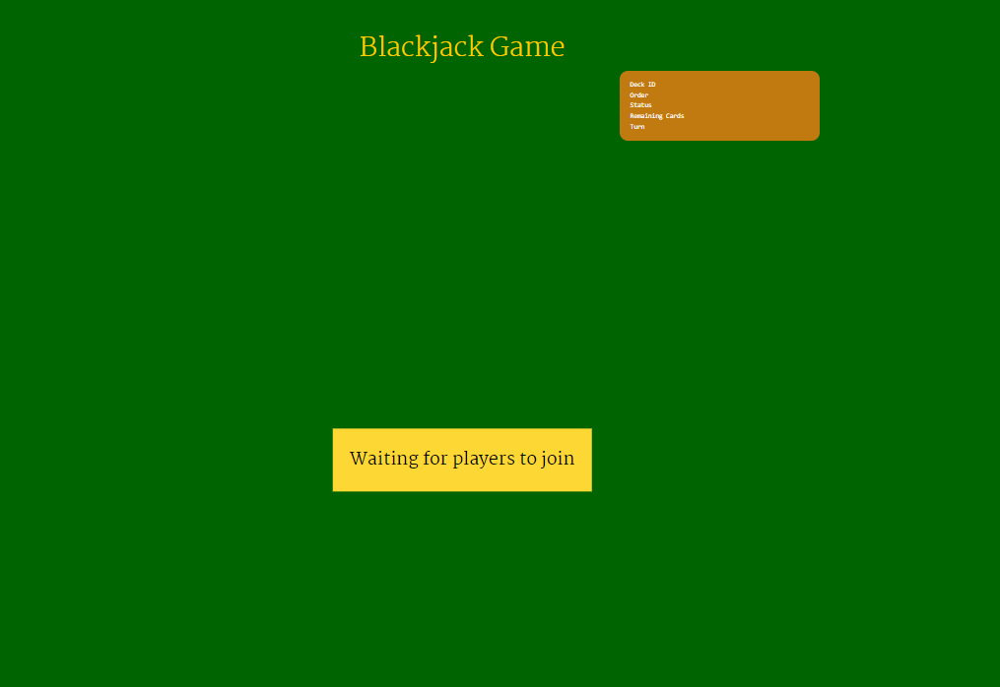
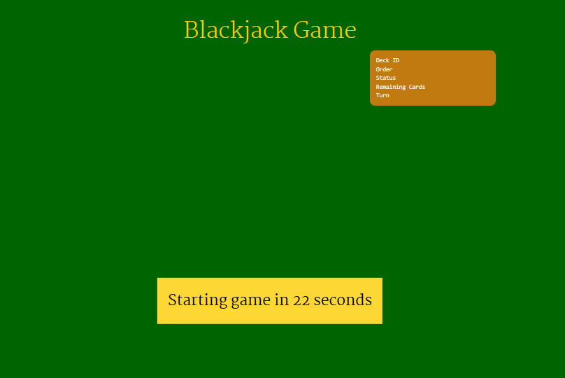
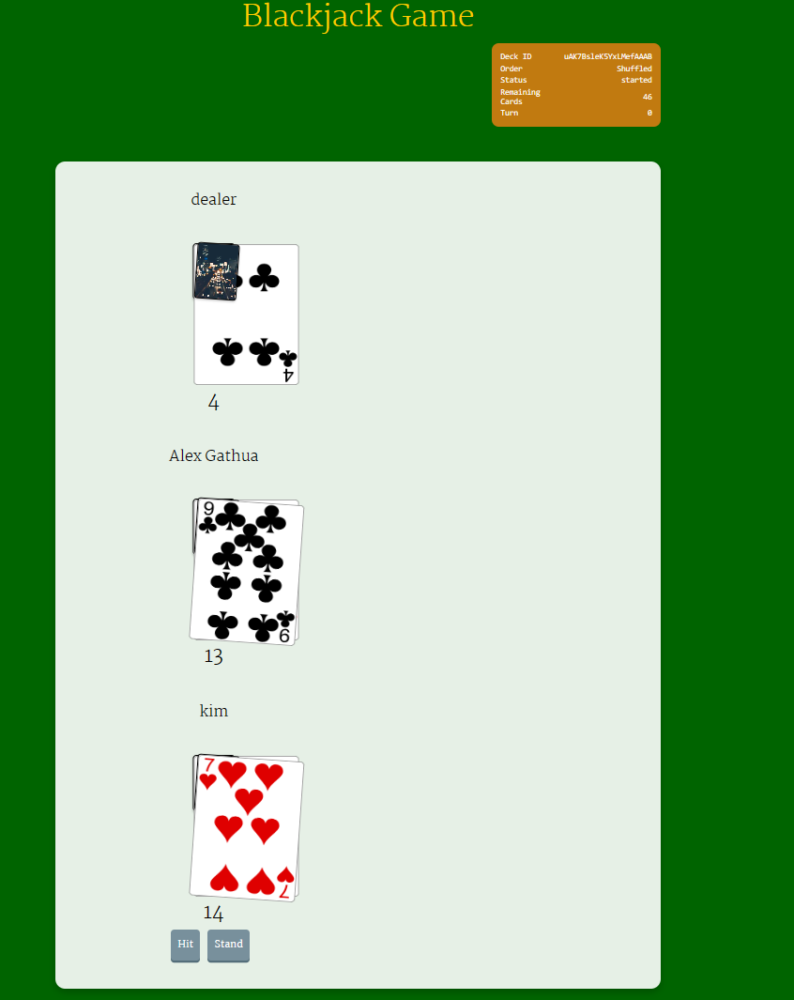
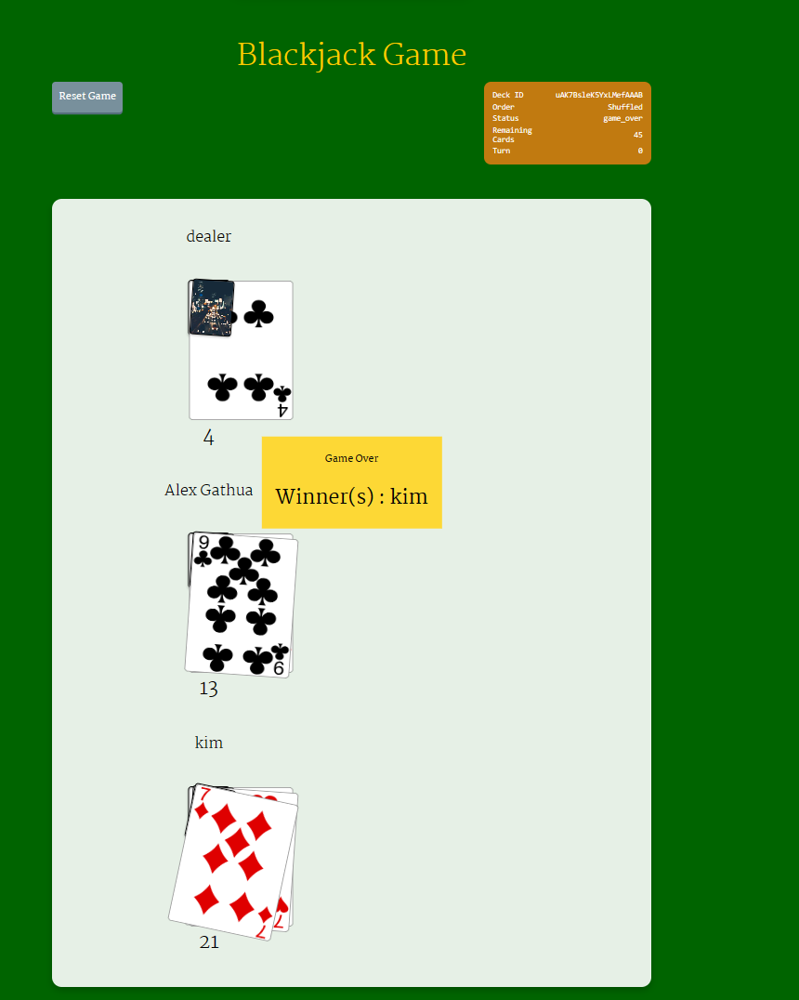

# BlackJack Game
This is a simple BlackJack game made in Python
 
## How to play
1. Run the program
2. Enter your name
3. You're dealt 2 cards and the dealer is dealt 1 card
4. You can either hit or stand
5. If you hit, you will be dealt another card
6. If you stand, the dealer will be dealt another card
7. If your total is greater than the dealer's total, you win
8. If your total is less than the dealer's total, you lose
9. If your total is equal to the dealer's total, you tie
10. If you get 21, you win
11. If the dealer gets 21, you lose
12. If you go over 21, you lose
13. If the dealer goes over 21, you win

## How to run
1. Download the code
2. Open the folder in your terminal
3. Run the command `python3 main.py`
4. Enjoy!
5. If you have any questions, feel free to ask me!

## Screenshots
### Waiting Players

### Start Game

### Hit or Stand

### Player Wins

 
